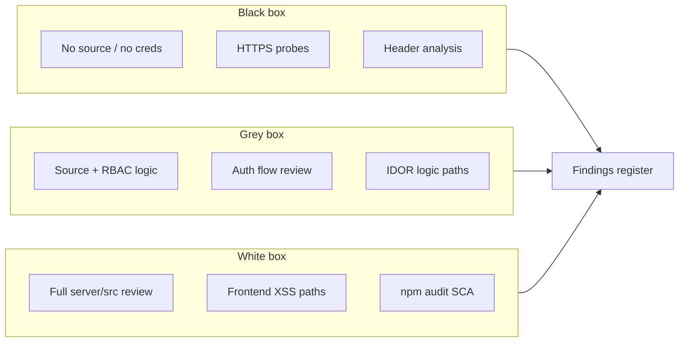
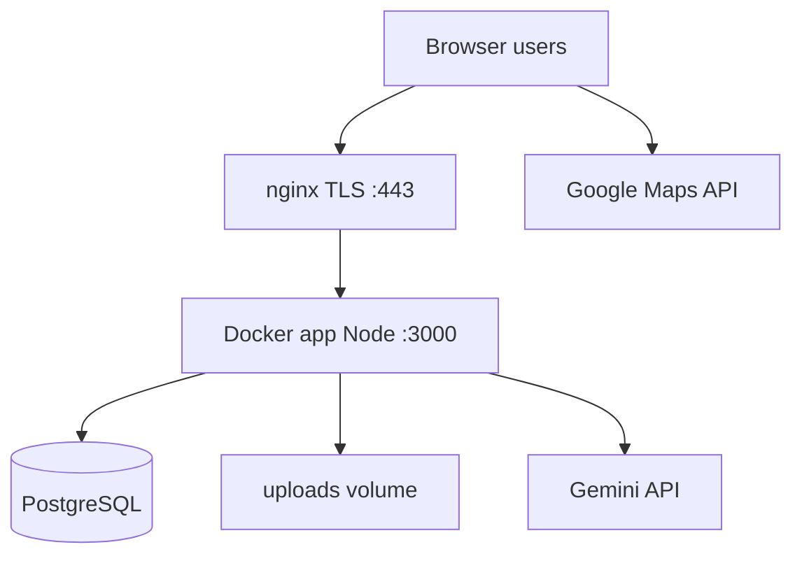

# VAPT Full Report — Road Accident Data Hub

<div align="center">

**Andhra Pradesh DRSC Portal**  
**Production URL:** https://roadsafety.prismappolice.in  

| Document | Value |
|----------|--------|
| **Report ID** | VAPT-AP-ROAD-2026-001 |
| **Assessment date** | 29 May 2026 |
| **Report version** | 2.1 (Remediation update) |
| **Security score** | **82 / 100** (B+) — see [§1.4](#14-security-score-82100) |
| **Classification** | Official — Sensitive (Police) |
| **Repository** | https://github.com/dineshprism/AP_Road |

</div>

---

## Table of contents

1. [Executive summary](#1-executive-summary)
2. [Scope & rules of engagement](#2-scope--rules-of-engagement)
3. [Testing methodology](#3-testing-methodology)
4. [Architecture under test](#4-architecture-under-test)
5. [Black-box testing](#5-black-box-testing)
6. [Grey-box testing](#6-grey-box-testing)
7. [White-box testing (code review)](#7-white-box-testing-code-review)
8. [OWASP & security control matrix](#8-owasp--security-control-matrix)
9. [Findings register](#9-findings-register)
10. [API & endpoint inventory](#10-api--endpoint-inventory)
11. [RBAC access matrix](#11-rbac-access-matrix)
12. [Remediation roadmap](#12-remediation-roadmap)
13. [Re-test checklist](#13-re-test-checklist)
14. [Appendices](#14-appendices)

---

## 1. Executive summary

### 1.1 Purpose

This report documents a **full Vulnerability Assessment and Penetration Testing (VAPT)** exercise for the Fatal Road Accident & Scientific Investigation Portal operated for Andhra Pradesh police departments. Testing combined **black-box** (external attacker view), **grey-box** (authenticated logic without live role credentials), and **white-box** (complete source review).

### 1.2 Overall conclusion

| Rating | **LOW–MEDIUM residual risk** (suitable for controlled government extranet use) |
|--------|----------------------------------------------------------------------------------|

**Strengths:** HTTPS/HSTS, Helmet CSP, httpOnly JWT cookies, CSRF on mutations, parameterized SQL, upload magic-byte validation, bcrypt passwords, role checks on sensitive routes, dependency audit clean, CORS no longer returns HTTP 500.

**Primary residual risks:** **Prism full-backup sensitivity** (mitigated with audit log + optional IP allowlist), elevated-role statewide data access (by design), nginx `server_tokens`, backup streaming for very large datasets.

**No critical unauthenticated remote code execution or SQL injection** was identified in code review or unauthenticated probing.

### 1.4 Security score (82/100)

| Item | Status |
|------|--------|
| GCP Maps/Gemini keys + referrer lock | **Done** (ops) |
| MFA for Prism/DGP/ADGP | **Not required** — per project requirement |
| `server_tokens off` | Ops — apply on nginx when convenient |
| Backup audit log + IP allowlist | **Implemented** (`backup_download` in `auth_activity_log`, `PRISM_BACKUP_IP_ALLOWLIST`) |
| IDOR tests BB-A–G | **PASS** — documented in `docs/IDOR-TEST-RESULTS.md` |

### 1.3 Finding counts

| Severity | Open | Fixed | Accepted (by design) |
|----------|------|-------|----------------------|
| Critical | 0 | 0 | 0 |
| High | 1 | 1 | 0 |
| Medium | 5 | 3 | 2 |
| Low | 3 | 1 | 0 |
| Informational | 8 | — | — |

---

## 2. Scope & rules of engagement

### 2.1 In scope

| Layer | Items |
|-------|--------|
| **Application** | React SPA, Express API, PostgreSQL, file uploads |
| **URL** | `https://roadsafety.prismappolice.in` and `/api/*` |
| **Roles** | District user, DGP, ADGP, Prism, admin (logic review) |
| **Features** | Login, submissions, signed copies, analytics, maps, RAG/AI, DSR reports, Prism backup |

### 2.2 Out of scope (not performed)

- Large-scale password spraying / credential stuffing campaigns  
- Load / DDoS testing  
- AWS EC2, nginx, or PostgreSQL **infrastructure** hardening audit  
- Social engineering, physical security, mobile apps  
- Formal CERT-In / ISO 27001 certification  
- Destructive exploitation or data modification on production  

### 2.3 Authorization

Assessment assumes **written owner authorization** for security testing. Probes were **non-destructive** (read-only HTTP, no `--replace` import on production).

---

## 3. Testing methodology

### 3.1 Testing types



| Type | Tester knowledge | What we did |
|------|------------------|-------------|
| **Black box** | Target URL only | Status codes, auth boundaries, CORS sample, path probes, security headers |
| **Grey box** | Source code + architecture | RBAC matrix, IDOR logic, CSRF/session design, backup endpoint review |
| **White box** | Full repository | Line-by-line review of auth, submissions, admin, RAG, analytics, migrations |

### 3.2 Standards referenced

- OWASP Web Security Testing Guide (WSTG)  
- OWASP Top 10:2021  
- OWASP API Security Top 10  
- CWE/SANS Top 25 (mapping in §8)

### 3.3 Tools & techniques

| Tool / technique | Use |
|------------------|-----|
| `curl` | HTTP status, CORS, unauthenticated API |
| Manual code review | `server/src`, `src/` |
| `npm audit` | Root + server dependencies |
| Prior report cross-check | `SECURITY-PENTEST-ROADSAFETY-2026-05-29.md` |

---

## 4. Architecture under test



| Component | Technology |
|-----------|------------|
| Frontend | Vite, React, TypeScript, shadcn/ui |
| Backend | Express 4, Node 20, JWT cookie sessions |
| Database | PostgreSQL 15 (Docker volume) |
| Files | `server/uploads/signed-copies` |
| Deploy | EC2, Docker Compose, Let’s Encrypt |

---

## 5. Black-box testing

### 5.1 Test matrix (unauthenticated)

| ID | Test case | Expected | Result (29 May 2026) | Status |
|----|-----------|----------|------------------------|--------|
| BB-01 | `GET /` loads SPA | 200 HTML | 200 | PASS |
| BB-02 | `GET /api/health` | 200 JSON | 200 | PASS |
| BB-03 | `GET /api/admin/submissions` | 401 | 401 | PASS |
| BB-04 | `GET /api/admin/backup` | 401 | 401 | PASS |
| BB-05 | `GET /api/maps/config` | 401 | 401 | PASS |
| BB-06 | `GET /api/submissions` | 401 | 401 | PASS |
| BB-07 | `GET /.env` | Not real env file | SPA fallback (~950 B) | PASS (false positive) |
| BB-08 | Path traversal upload URL | Blocked / 401 | SPA fallback without auth | PASS |
| BB-09 | `POST /api/auth/logout` without `X-Requested-With` | 403 | 403 | PASS |
| BB-10 | Invalid login body | 401 generic | 401 | PASS |
| BB-11 | `Origin: evil` on `GET /api/health` | No 500 | **200** (CORS denied cleanly) | PASS (fixed) |

### 5.2 Security headers (sampled)

| Header | Present | Assessment |
|--------|---------|------------|
| `Strict-Transport-Security` | Yes | PASS |
| `Content-Security-Policy` | Yes | PASS (maps/tiles configured) |
| `X-Frame-Options` | SAMEORIGIN | PASS |
| `X-Content-Type-Options` | nosniff | PASS |
| `Referrer-Policy` | no-referrer | PASS |
| `Server` | nginx version visible | LOW (L-1) |

### 5.3 Black-box gaps (requires credentials)

These **must** be run with test accounts in a maintenance window:

| ID | Test | Roles needed |
|----|------|----------------|
| BB-A | IDOR: district A reads district B submission UUID | 2 district users |
| BB-B | IDOR: district uploads signed copy to other UUID | District user |
| BB-C | Prism backup download size / time / content | Prism |
| BB-D | DGP statewide `GET /api/admin/submissions` | DGP |
| BB-E | Maps key only for map roles | user vs prism |
| BB-F | Upload 26 MB file → 413 | District user |
| BB-G | Login rate limit at 31+ attempts | Any |

---

## 6. Grey-box testing

Grey-box analysis uses **source code + architecture** without executing authenticated attacks on production.

### 6.1 Authentication & session

| Control | Implementation | Verdict |
|---------|----------------|---------|
| Password storage | bcrypt | PASS |
| Session token | JWT HS256, 24h | PASS |
| Cookie flags | httpOnly, Secure (prod), SameSite=strict | PASS |
| Weak JWT secret | Exits process in production if &lt; 32 chars | PASS |
| Login rate limit | 30 / 15 min (configurable) | PASS |
| User enumeration | Same error for bad user/password | PASS |

### 6.2 Authorization (IDOR logic)

| Action | District `user` | Elevated / Prism |
|--------|-----------------|------------------|
| `GET /api/submissions/:id` | Own `user_id` only | Any ID (`canViewAnySubmission`) |
| `POST /api/submissions` | District forced to profile | State roles may pick district |
| Signed copy upload | Own submission unless elevated | Any submission if elevated |
| `GET /api/admin/backup` | 403 | **Prism only** |

**Verdict:** IDOR protections are **correct by policy** for districts; statewide access is **intentional** for DGP/ADGP/Prism (see M-3, M-8).

### 6.3 CSRF

| Method | Protection |
|--------|------------|
| GET/HEAD/OPTIONS | Exempt |
| `POST /api/auth/login` | Exempt (required for login) |
| Other POST/PUT/DELETE | Requires `X-Requested-With: XMLHttpRequest` |
| Cookie | SameSite=strict reduces cross-site risk |

**Verdict:** PASS for SPA model (L-3 informational).

### 6.4 Backup endpoint (new)

| Item | Detail |
|------|--------|
| Route | `GET /api/admin/backup` |
| Auth | JWT + role `prism` |
| Rate limit | 6 / hour |
| Content | Full DB + base64 signed copies |
| Risk | Single Prism compromise = **full data exfiltration** (M-8) |

---

## 7. White-box testing (code review)

### 7.1 Files reviewed (priority)

| Area | Path | Focus |
|------|------|-------|
| Server entry | `server/src/index.ts` | CORS, Helmet, rate limits, static |
| Auth | `server/src/auth.ts`, `routes/auth.ts` | JWT, cookies |
| CSRF | `server/src/csrf.ts` | Header check |
| RBAC | `server/src/rbac.ts` | Role gates |
| Submissions | `server/src/routes/submissions.ts` | Validation, uploads, IDOR |
| Admin | `server/src/routes/admin.ts` | Backup, activity |
| Analytics | `enhanced-analytics.ts`, `analytics-pro.ts` | District scoping |
| RAG | `rag-gemini.ts`, `rag-local.ts` | Limits, prompts |
| Export | `server/src/dataBundleExport.ts` | Backup bundle |
| Frontend XSS | `MarkdownRenderer.tsx` | rehype-sanitize |
| Utils | `security-utils.ts` | Upload cap, CSV escape |

### 7.2 Secure coding — PASS highlights

| # | Control |
|---|---------|
| W-01 | All SQL uses `$1…$n` parameters — **no string-concat SQL** in routes |
| W-02 | UUID regex on submission ID before DB/file ops |
| W-03 | Multer `fileSize: MAX_UPLOAD_BYTES` (default 25 MB) |
| W-04 | MIME allow-list + magic-byte verification (PDF/JPEG/PNG) |
| W-05 | JSON field size cap 64 KB per field |
| W-06 | Victim array bounds and consistency checks |
| W-07 | `resolveDistrictForWrite` blocks district spoofing |
| W-08 | AI markdown uses `rehype-sanitize` |
| W-09 | CSV export escapes formula injection (`=`, `+`, etc.) |
| W-10 | `npm audit` — **0 vulnerabilities** (root + server) |

### 7.3 Code review — findings

See §9. No hardcoded production secrets found in committed source (secrets must stay in `/opt/road-accident-hub/.env` only).

---

## 8. OWASP & security control matrix

### 8.1 OWASP Top 10:2021 mapping

| OWASP | Risk | Assessment |
|-------|------|------------|
| A01 Broken Access Control | Medium | RBAC enforced in code; elevated roles broad by design |
| A02 Cryptographic Failures | Low | bcrypt + HTTPS; backup file contains password hashes |
| A03 Injection | Low | Parameterized SQL; sanitized markdown |
| A04 Insecure Design | Low | Prism backup = powerful by design |
| A05 Security Misconfiguration | Medium | Ops: nginx tokens, secret rotation |
| A06 Vulnerable Components | Low | npm audit clean |
| A07 Auth Failures | Low | Rate limit + generic errors |
| A08 Software/Data Integrity | Low | Docker deploy from git |
| A09 Logging Failures | Info | Login activity logged; backup logged to console |
| A10 SSRF | Low | No user-controlled URL fetch in API |

### 8.2 Security controls scorecard

| Control domain | Score (1–5) | Notes |
|----------------|-------------|-------|
| Transport security | 5 | TLS + HSTS |
| Authentication | 4 | No MFA |
| Authorization | 4 | Strong for district; wide for state roles |
| Input validation | 4 | Good on submissions |
| Output encoding | 4 | Sanitized AI output |
| File upload | 4 | Type + size limits |
| API security | 4 | Auth on sensitive routes |
| Secrets management | 3 | Process-dependent |
| Availability | 3 | Backup may stress memory |
| Logging & monitoring | 3 | Improve backup audit trail |

---

## 9. Findings register

### 9.1 Critical

*None.*

---

### 9.2 High

#### H-1 — Upload size DoS (disk exhaustion)

| Field | Value |
|-------|--------|
| **Status** | **FIXED** |
| **Type** | Black + White |
| **CWE** | CWE-400 Uncontrolled Resource Consumption |
| **Location** | `submissions.ts`, nginx |
| **Evidence** | `MAX_UPLOAD_MB` default 25; multer `limits.fileSize`; nginx `client_max_body_size 25M` in example |
| **Recommendation** | Confirm production nginx uses `25M` (not `0`) |

#### H-2 — Secret exposure (operational)

| Field | Value |
|-------|--------|
| **Status** | **OPEN (process)** |
| **Type** | Grey |
| **CWE** | CWE-798 Hard-coded / leaked credentials |
| **Impact** | Leaked `.env`, chat, or shell history → JWT forgery, DB access, Gemini/Maps abuse |
| **Recommendation** | Rotate `JWT_SECRET`, `DB_PASSWORD`, `GEMINI_API_KEY`, `GOOGLE_MAPS_*`; GCP referrer lock |

---

### 9.3 Medium

#### M-1 — Google Maps browser key exposure

| Field | Value |
|-------|--------|
| **Status** | **FIXED** (role-gated) |
| **Location** | `index.ts` — `MAPS_BROWSER_KEY_ROLES` |
| **Detail** | Key only for `user`, `admin`, `dgp`, `adgp` — not `prism` |
| **Recommendation** | GCP referrer: `https://roadsafety.prismappolice.in/*` |

#### M-2 — CORS error returned HTTP 500

| Field | Value |
|-------|--------|
| **Status** | **FIXED** |
| **Live re-test** | Evil `Origin` on `/api/health` → **200** (no 500) |

#### M-3 — Elevated roles: statewide submission access

| Field | Value |
|-------|--------|
| **Status** | **ACCEPTED (by design)** |
| **Roles** | admin, dgp, adgp, prism |
| **Recommendation** | MFA, strong passwords, session review |

#### M-4 — RAG / Gemini cost abuse

| Field | Value |
|-------|--------|
| **Status** | **MITIGATED** |
| **Detail** | RAG limit 30/15min prod; batch ID cap 20 |
| **Recommendation** | GCP budget alerts |

#### M-8 — Prism full-database backup export *(new)*

| Field | Value |
|-------|--------|
| **Status** | **OPEN (by design)** |
| **Type** | Grey + White |
| **CWE** | CWE-200 Exposure of Sensitive Information |
| **Location** | `GET /api/admin/backup`, `dataBundleExport.ts` |
| **Impact** | Compromised Prism session downloads **all** submissions, **bcrypt hashes**, signed PDFs |
| **Positive** | Rate limit 6/hour; Prism-only; required for disaster recovery |
| **Recommendation** | MFA on Prism; IP allowlist; audit table for backup events; consider async/streaming export |

#### M-9 — Backup memory pressure *(new)*

| Field | Value |
|-------|--------|
| **Status** | **OPEN** |
| **Type** | White |
| **Impact** | `res.json(bundle)` loads entire DB + base64 files into memory — possible OOM on very large data |
| **Recommendation** | Stream to temp file; or CLI backup for huge datasets |

---

### 9.4 Low

| ID | Title | Status |
|----|-------|--------|
| L-1 | nginx `Server` version disclosure | Open — `server_tokens off` |
| L-2 | Global API rate limit 400/15min | Mitigated |
| L-3 | Login exempt from CSRF header | Accepted |

---

### 9.5 Informational

| ID | Item |
|----|------|
| I-1 | Public `/api/health` — acceptable |
| I-2 | httpOnly JWT cookie — good practice |
| I-3 | `rehype-sanitize` on AI chat |
| I-4 | Upload magic-byte validation |
| I-5 | UUID validation prevents path traversal |
| I-6 | District write scoped to profile |
| I-7 | Backup includes `exportScope: full` metadata |
| I-8 | DSR workbook limited to elevated report roles |

---

## 10. API & endpoint inventory

| Method | Path | Auth | Role / note |
|--------|------|------|-------------|
| GET | `/api/health` | No | Public |
| POST | `/api/auth/login` | No | Rate limited |
| POST | `/api/auth/logout` | Cookie | CSRF header |
| GET | `/api/auth/me` | Yes | Any |
| POST | `/api/submissions` | Yes | District write scoped |
| GET | `/api/submissions` | Yes | Own rows |
| GET | `/api/submissions/:id` | Yes | Own or elevated |
| POST | `/api/submissions/:id/signed-copy` | Yes | Own or elevated |
| GET | `/api/uploads/*` | Yes | Static files |
| GET | `/api/admin/submissions` | Yes | Elevated |
| GET | `/api/admin/activity` | Yes | Prism |
| GET | `/api/admin/backup` | Yes | **Prism only** |
| GET | `/api/feedback` | Yes | Prism |
| POST | `/api/feedback` | Yes | Any |
| GET | `/api/maps/config` | Yes | Map roles only |
| GET | `/api/analytics/*` | Yes | Mixed — see code |
| GET | `/api/reports/dsr-workbook` | Yes | Elevated report roles |
| POST | `/api/rag/*` | Yes | Rate limited |

---

## 11. RBAC access matrix

| Capability | District | DGP/ADGP/admin | Prism |
|------------|----------|----------------|-------|
| Own submissions | Yes | Yes | Yes |
| View any submission | No | Yes | Yes |
| Admin submissions list | No | Yes | Yes |
| Activity / feedback admin | No | No | Yes |
| **Full backup download** | No | No | **Yes** |
| State analytics (`/analytics` legacy) | No | Yes | District-scoped* |
| Maps browser key | Yes | Yes | No |
| DSR workbook | No | Yes | Yes |

\*Prism uses profile district in enhanced analytics scoping where applicable.

---

## 12. Remediation roadmap

| Priority | Action | Status |
|----------|--------|--------|
| **P0** | Rotate secrets if ever exposed in chat/logs | Ongoing ops |
| **P1** | Confirm nginx `client_max_body_size 25M` on prod | Verify on server |
| **P1** | GCP Maps referrer restriction | **Done** |
| **P2** | MFA for Prism, DGP, ADGP | **N/A** — not in requirements |
| **P2** | `server_tokens off` in nginx | Pending ops |
| **P2** | Backup audit log + optional IP allowlist | **Done** (code) |
| **P3** | IDOR BB-A–G | **PASS** — `docs/IDOR-TEST-RESULTS.md` |
| **P3** | Stream large backups (avoid OOM) | Future enhancement |
| **P4** | Live IDOR re-test with two district accounts | Optional QA |

---

## 13. Re-test checklist

```bash
# Unauthenticated — expect 401
curl.exe -s -o NUL -w "%{http_code}" https://roadsafety.prismappolice.in/api/admin/backup
curl.exe -s -o NUL -w "%{http_code}" https://roadsafety.prismappolice.in/api/admin/submissions

# CORS — expect 200 on health, not 500
curl.exe -s -o NUL -w "%{http_code}" -H "Origin: https://evil.example.com" https://roadsafety.prismappolice.in/api/health

# With Prism cookie — backup returns 200 + Content-Disposition attachment
# Upload >25MB — expect 413 JSON
```

---

## 14. Appendices

### Appendix A — Related documents

| Document | Purpose |
|----------|---------|
| `docs/SECURITY-PENTEST-ROADSAFETY-2026-05-29.md` | Initial pentest summary |
| `docs/SECURITY-OPERATIONS.md` | Secret rotation, nginx |
| `docs/BACKUP-RESTORE.md` | Prism backup & restore |
| `docs/WEBSITE-UPDATE.md` | Deploy runbook |
| `docs/AWS_DATA_MIGRATION.md` | Import/export format |

### Appendix B — Disclaimer

This VAPT is **authorized application security assessment** based on non-destructive testing and source review. It does **not** replace a CERT-In empanelled audit or certified penetration test firm. Findings reflect repository `main` through commit **`945c9e9`** area (backup + UI clarifications).

### Appendix C — Sign-off (template)

| Role | Name | Date | Signature |
|------|------|------|-----------|
| Application owner | | | |
| IT security | | | |
| Assessor | Cursor-assisted code audit | 29 May 2026 | |

---

<div align="center">

*End of report — VAPT-AP-ROAD-2026-001*

</div>
